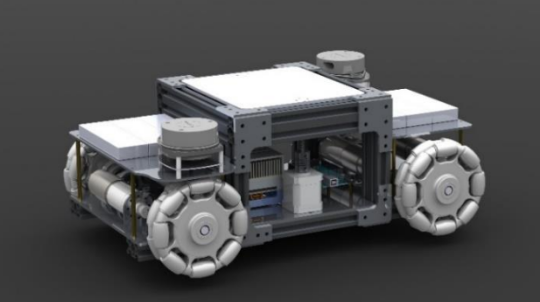

# Design-And-Control-Of-Swarm-Of-Autonomous-Mobile-Industrial-Robots (Bachelor Thesis)

This repository contains a project mainly focuses on designing and implementing two mobile industrial Robots (octa_kit and Naqel_kit) each has 4 mecanum wheels and lifting mechanism to lift and transport products in warehouses. the control of mobile robots using ROS Melodic platform proofs to be reliable with high level of accuracy and precision. In the aim of developing swarm technique between two mobile robots, two robots are manufactured and one of them has been successfully modeled and simulated in both Rviz and Gazebo in which it navigates through a previously built map using LIDAR. The robot managed to reach the end point with the specified pose with acceptable accuracy.

 

This project is done by Team of 6 memebers from Nile University:
1. Ahmed Mohsen Ali (me)
2. Mamdouh Ezz
3. Jomana Ashraf
4. Mazen Ahmed Taha
5. Sohaila Ahmed 
6. Mohamed Tarek Keshk

Under the supersision of **Dr.Mahmoud El-samamty** ana **Eng.Mennatallah Soliman**.

Mentored by **VALEO** and funded by the **ARST (Academy of scientific Research and Technology)**. 

## General Setup

This project is done using ROS Melodic so you need to install some packages before cloning the project, some of the steps below:

1. Download ROS Melodic using this link: https://www.ros.org/install/ 
2. Dowload the navigation stack using this link: https://github.com/ros-planning/navigation.git

To start this project you need to clone the project in the src folder in the workspace:

    $ cd /workspace/src

    $ cd..

    $ catkin_make

To visuallize the Octa_kit:

    $ roslaunch octa_kit navigation.launch

To visuallize the Naqel_kit:

    $ roslaunch Naqel_kit urdf_final.launch

SWARM Initiation is made by introducing the two robots to the same environment and the two robots can move:

To visuallize the two robots in the same map:
    
    $ roslaunch multi_robot multi_sim.launch
    

To use the navigation stack for the movement:

    $roslaunch multi_robot_nav nav.launch
    
 ### External information

For more details you can visit ROSWIKI or check the team report from this link: https://drive.google.com/file/d/1NA_cO5XRFUWNk_7cYEJZ8mevnUOzOULn/view?usp=sharing 

